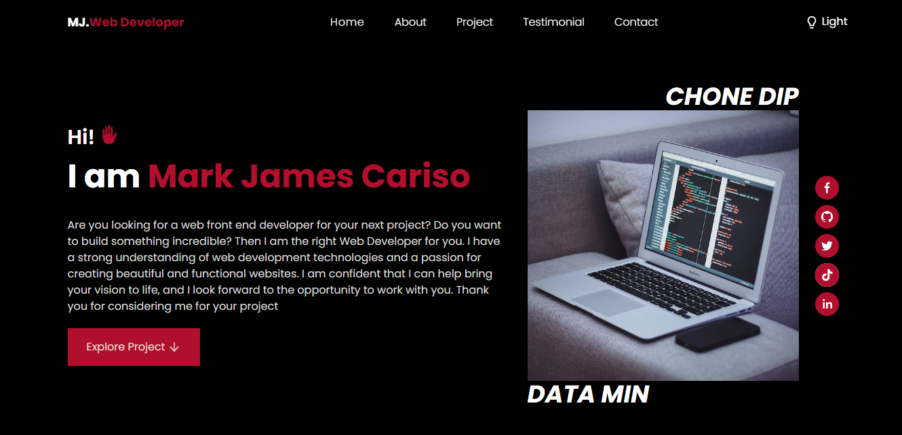

 
<h3 align="center">Hello, my name is MJ Cariso and I am a student pursuing a degree in Information Technology. I am eager to enter the workforce and put my skills and knowledge to use as a front end developer or software engineer. I am passionate about using technology to create innovative solutions and am determined to succeed in this field.</h3>

  

- 🌱 I’m currently learning **React**

- 👨‍💻 All of my projects are available at [https://emjay03.github.io/Portfolio/)

- 📫 How to reach me **mjcariso3@gmail.com**

- ⚡ Fun fact **I have several girlfriends, including Minatozaki, Miyeon, Suzy, Winter, Hanni, Ryujin, Yeonwoo, and Yoona and 99 Others**

<h3 align="left">Connect with me:</h3>

<h3 align="left">Languages:</h3>
  

<h3 align="left">Tools:</h3>

  

<h3 align="left">Frameworks:</h3>

  

